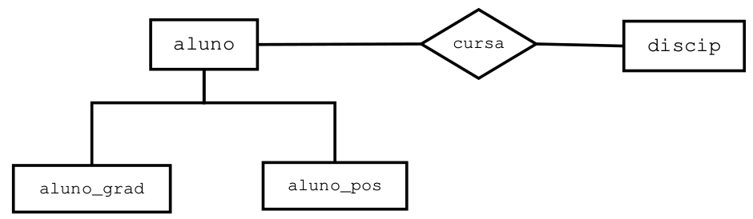

# REGRAS DE NEGÓCIO E PROGRAMAÇÃO DE SGBD

## Introdução

Nesse capítulo, iremos trabalhar com recursos utilizados tanto pelos administradores quanto pelos programadores.  
Ao longo desse material, serão abordados os seguintes assuntos:  

* Implementação de Regras de Negócio no momento de criação das tabelas (*Check*);  
* Sequências (Sequences);  
* Visões (View);  
* Procedimentos Armazenados (Stored Procedures);  
* Gatilhos (Triggers).


Antes de começarmos,**vamos criar um novo database** para os testes desse capítulo:
```sql
CREATE DATABASE chapregras;
```

## Implementando Regras de Negócio
As regras de negócio (regras aos quais os valores dos dados devem obedecer) podem serem implementadas no momento da criação das tabelas por meio das restrições *check* e *unique*.  

### Restrição Check  
A restrição CHECK no SQL é usada para impor uma condição específica em uma coluna de uma tabela. Ela garante que os valores inseridos ou atualizados naquela coluna atendam a determinados critérios, ajudando a manter a integridade dos dados.
A restrição CHECK é útil para evitar dados inválidos no banco de dados, reduzindo a necessidade de verificações adicionais na aplicação. 

**Exemplo**: Condição check que garante idades positivas:    
```sql
CREATE TABLE Clientes (
    ID INT,
    Nome VARCHAR(100),
    Idade INT,
    CONSTRAINT pk_clientes PRIMARY KEY (ID),
    CONSTRAINT ck_Idade CHECK (Idade > 0) -- Garante que apenas clientes com pelo menos 01 ano sejam cadastrados
);
```

**Exemplo**: Impedindo que um salário seja **inferior** ou **superior** a um teto:  
```sql
CREATE TABLE Funcionarios (
    ID INT PRIMARY KEY,
    Nome VARCHAR(100),
    Salario DECIMAL(10,2) CHECK (Salario BETWEEN 1000 AND 50000) -- Restringe o salário a um intervalo
);
```

### Restrição Unique
Para garantir a unicidade de valores de campos que não são chave primária, no caso **chaves candidatas**, usamos a restrição *unique*.  
A restrição UNIQUE no SQL é usada para garantir que os valores de uma ou mais colunas em uma tabela sejam únicos, ou seja, não se repitam entre as linhas. Isso **ajuda a manter a integridade dos dados**, **evitando duplicações** indesejadas.  

**Exemplo**: Na implementação da tabela Aluno, a chave primária deve ser RA e o campo CPF deve ser único:  
```sql
create table aluno(
    ra integer, -- chave candidata
    nome varchar(40),
    cpf varchar(12), -- chave candidata
    constraint pk_aluno primary key (ra),
    constraint un_cpf unique (cpf)
);
```

**Exemplo**: Podemos garantir que a combinação de duas ou mais colunas seja única:  
```sql
CREATE TABLE Pedidos (
    ID INT PRIMARY KEY,
    ClienteID INT,
    ProdutoID INT,
    UNIQUE (ClienteID, ProdutoID)  -- Garante que o mesmo cliente não peça o mesmo produto duas vezes
);
```

### 📝 Exercícios
1. Crie o modelo físico das relações **correntista** = {_cpf (pk), nome, data_nasc, cidade, uf_} e **conta_corrente** {_num_conta (pk), cpf_correntista (fk), saldo_}.
Garanta as seguintes regras de negócio:  
    (a) Os correntistas devem ser maiores que 18 anos. Para isso, você deve comparar a data de nascimento com a data atual. No Postgres, para saber a idade atual, use a função
   ```sql
   ((CURRENT_DATE - data_nasc)/365>=18) ou use a função (AGE(CURRENT_DATE, data_nasc) >= '18 Y’)).
   ```   
    (b) Uma conta corrente só pode ser aberta com saldo mínimo **inicial de R$ 500,00**.  

## _Sequences_ (Sequências)
Uma **_Sequence_** (sequência) é um objeto de banco de dados criado pelo usuário que pode ser compartilhado por vários usuários para gerar números inteiros exclusivos de acordo com regras especificadas no momento que a sequência é criada.  

A **sequence** é gerada e incrementada por uma rotina interna do SGBD. Normalmente, as sequências são usadas para criar **um valor de chave primária** que deve ser exclusivo para cada linha de uma tabela. 

Vale a pena salientar que os números de sequências **são armazenados e gerados de modo independente das tabelas**. Portanto, o mesmo objeto sequência pode ser usado por várias tabelas e inclusive por vários usuários de banco de dados caso necessário. **Mas isso não é recomendado**.

Geralmente, convém atribuir à sequência um nome de acordo com o uso a que se destina; no entanto, ela poderá ser utilizada em qualquer lugar,  independente do nome.  

Sequências são **frequentemente** utilizados para **produzir valores únicos** em colunas definidas como **chaves primárias**.  

Neste caso, você pode enxergar essas sequências como campos do tipo _auto-incremento_.  

Cada sequência deve ter um nome que a identifique. O padrão para o nome pode ser _**sid_nome_da_tabela**_.  

### Como criar uma SEQUENCE?
Para criar uma SEQUENCE, usamos o comando CREATE SEQUENCE:  
```sql
CREATE SEQUENCE sid_minha_sequence
START WITH 1  -- Primeiro valor gerado (opcional)
INCREMENT BY 1  -- Incremento entre os valores (opcional)
MINVALUE 1  -- Valor mínimo permitido (opcional)
MAXVALUE 1000  -- Valor máximo permitido (opcional)
CYCLE;  -- Faz a sequência reiniciar após atingir o MAXVALUE (opcional)
```

**Onde**:  
**START WITH 1** → Começa a sequência a partir de 1.  
**INCREMENT BY 1** → Incrementa o valor em 1 a cada chamada.  
**MINVALUE 1** → O menor valor permitido é 1.  
**MAXVALUE 1000** → O maior valor permitido é 1000 (opcional).  
**CYCLE** → Quando atinge o MAXVALUE, ele reinicia para o MINVALUE.    

### Usando as SEQUENCES (NEXTVAL)

**Exemplo**: **Criando e usando** uma sequencia para tabela Usuários:
```sql

create sequence sid_usuarios;

SELECT NEXTVAL('sid_usuarios');

CREATE TABLE Usuarios (
    ID INT PRIMARY KEY,
    Nome VARCHAR(100)
);

insert into usuarios
values (nextval('sid_usuarios'), 'joao');
```

### Usando o SERIAL ou BIGSERIAL  
O tipo de dado SERIAL no PostgreSQL é usado para criar chaves primárias **auto-incrementáveis de forma automática**. Ele internamente cria uma SEQUENCE, que gera os valores sequenciais para a coluna.  


**Exemplo**: **Criando e usando** uma sequencia para tabela Usuários:
```sql

CREATE TABLE diarios (
    diarioID SERIAL PRIMARY KEY,  -- serial ou bigserial vai depender da quantidade de registros
    diarioIDBig BIGSERIAL,
    descricao VARCHAR(100)
);

INSERT INTO diarios
values (default, default, 'Banco de Dados');
```

#### Como funciona o SERIAL internamente?
Quando usamos SERIAL, o PostgreSQL automaticamente faz três coisas:  

1. Cria uma SEQUENCE associada
2. Define a coluna como _DEFAULT nextval('sequence_name')_
3. Vincula a sequence à tabela

**Exemplo**: Exemplo do que o **PostgreSQL cria internamente** ao usar SERIAL:
```sql
CREATE SEQUENCE usuarios_id_seq START WITH 1 INCREMENT BY 1;
ALTER TABLE Usuarios ALTER COLUMN ID SET DEFAULT nextval('usuarios_id_seq');
```

### Obtendo o Último ID Inserido
Após inserir um registro, podemos recuperar o ID gerado:
```sql
INSERT INTO diarios
values (default, default, 'Estrutura de Dados') RETURNING diarioid, diarioidbig;

```

### CURRVAL
Traz o valor atual da sequence:
```sql
select currval('sid_usuarios');
```

### Como apagar uma SEQUENCE?
Para remover uma SEQUENCE no PostgreSQL, usamos o comando:
```sql
DROP SEQUENCE minha_sequence;
```

**Exemplo**: Para apagar a sequence *sid_usuarios*:
```sql
DROP SEQUENCE sid_usuarios;
```

#### Apagando uma SEQUENCE associada a uma tabela
Se a sequência estiver vinculada a uma coluna (exemplo: ID com SERIAL), devemos remover a ligação primeiro:
```sql
ALTER TABLE diarios ALTER COLUMN diarioID DROP DEFAULT;
```

### 📝 Exercício de Sequências


1) Considere o seguinte modelo relacional baseado no DER da **figura acima**:
```sql
obra = {id_obra(pk), codigo (unique), descricao}

maquina = {id_maquina(pk), codigo(unique), marca}

usa = {id_usa(pk), id_obra(fk), id_maquina(fk), data_do_uso}
```

    1.1. Crie as tabelas obra, maquina, usa e suas respectivas sequências.
    1.2. Insira duas obras e duas máquinas usando as sequência criadas.
    1.3. Atribua para cada obra as duas máquinas.

## _OPERAÇÕES COM CONJUNTOS EM SQL_

A **Álgebra Relacional** é uma linguagem de consulta procedural (o usuário descreve os passos a serem executados) e formal a qual a técnica utilizada é fundamental para a extração de dados de um banco de dados, além de ser um conjunto de operações, os quais utilizam como recurso de entrada uma ou mais relações, produzindo então, uma nova relação.

As principais operações da Álgebra Relacional são **Seleção, Projeção, União, Diferença, Intesecção, Produto Cartesiano, Junção e Divisão**.  As **operações da linguagem SQL são baseadas nas operação da Álgebra Relacional**. Foi visto na disciplina de Banco de Dados que as operações Projeção (comando Select) , Seleção (cláusula Where), Junção (operação Inner Join) e Produto Cartesiano (cláusula FROM sem a cláusula Where).

Vamos usar um novo banco de dados. Agora, iremos rodar o script disponibilizado no repositório da disciplina:
```sql
nome do script: 00_criabaseBD_Postgres.sql
```

### Operação União (Union e Unial All)

A união de duas tabelas é formada pela adição dos registros de uma tabela aos registros de uma segunda tabela,
para produzir uma terceira. Assim, o operador **union** serve para juntar ou unir dois comandos *selects*, um
abaixo do outro. As linhas repetidas são ignoradas.

**Exemplo 1:** Monte um relatório com os nomes dos instrutores e alunos cadastrados no banco de dados. Garanta
que os **nomes repetidos sejam eliminados**:

```sql
SELECT inst_nome as Nome FROM instrutor
UNION
SELECT alu_nome as Nome FROM aluno;
```

**Exemplo 2:** Monte um relatório com os nomes dos clientes e vendedores cadastrados no banco de dados. Garanta
que os **nomes repetidos sejam eliminados**:

```sql
SELECT nome_cliente as Nome FROM cliente
UNION
SELECT nome_vendedor as Nome FROM vendedor;
```

**Exemplo 3:** Refaça a consulta anterior mostrando também os nomes repetidos:
```sql
SELECT nome_cliente as Nome FROM cliente
UNION ALL
SELECT nome_vendedor as Nome FROM vendedor;
```

**Exemplo 4:** Monte uma consulta utilizando o UNION para trazer a descrição dos produtos e suas unidades. porém, traga apenas as unidades M e SAC
```sql
select descricao, unidade from produto
where unidade = 'M'
UNION
select descricao, unidade from produto
where unidade = 'SAC';
```

### Operação Interseção (comando Intersect)
Esta operação atua sobre duas tabelas compatíveis em domínio e produz uma terceira contendo os **registros que aparecem simultaneamente** em ambas tabelas. O **operador _In_** redunda no mesmo resultado do operador *Intersect*. Entretanto, aquele não necessita da compatibilidade de domínio.

**Exemplo 1:** Desenvolva uma consulta que preencha uma página html com os nomes homônimos de instrutores
e alunos:
```sql
select inst_nome as nome from instrutor
INTERSECT
select alu_nome as nome from aluno;
```

**Exemplo 2:** A Grid de um Form de uma aplicação bancária desktop deve ser preenchida com os dados de uma consulta que traga os códigos do cliente que possuem conta (tabela Depositante) e também empréstimo (tabela Devedor). Use o operador Intersect:
```sql
select cod_cli_dep from depositante
INTERSECT
select cod_cli_dev from devedor;
```

### Operação Diferença (comando Except)
A diferença de duas tabelas é uma terceira tabela contendo os registros que ocorrem na primeira tabela mas não ocorrem na segunda. O **operador _Not In_** redunda no mesmo resultado do operador **Except**. Entretanto, aquele não necessita da compatibilidade de domínio.

**Exemplo 1:** Monte um relatório que traga o código do cliente que possui conta (depositante) mas que não possui empréstimo (devedor):
```sql
select cod_cli_dep from depositante
EXCEPT
select cod_cli_dev from devedor;
```

**Exemplo 2:** Monte a consulta em SQL para um relatório que traga os nomes dos instrutores que não são homônimos dos alunos (usando o **Except**).:
```sql
select inst_nome as nome from instrutor
EXCEPT
select alu_nome as nome from aluno;
```

### Compatibilidade de domínio
Assim com as operações da Álgebra Relacional, as **operações sobre conjuntos** com os comandos SQL **exigem Compatibilidade de Domínio**, ou seja, campo texto embaixo de campo texto, campo numérico embaixo de campo numérico.


**Exemplo 1:** Execute a consulta a seguir e discuta o porquê do resultado:

```sql
select nome_cliente as nome from cliente
UNION
select total_pedido as nome from pedido;
```

### 📝 Exercícios sobre Álgebra Relacional
1) Monte uma consulta SQL para trazer os nomes dos clientes (tabela *cliente*) e dos vendedores (tabela *vendedor*) e a respectiva quantidade de pedido (tabela *pedido*) que cada um realizou. Utilize o operador UNION para unir as duas consultas. Para cada consulta, você terá que usar uma junção com a tabela pedido.


## VIEW (VISÃO)   
Do **ponto de vista do negócio,** visões são elementos estratégicos que normalmente limitam o poder de acesso a informações. Do **lado técnico**, uma **visão é uma <ins>tabela virtual</ins> resultante de uma consulta efetuada sobre uma ou mais tabelas**. A visão é baseada em uma ou mais tabelas ou outra view, logo uma view não contém dados próprios mas sim dados provenientes de outas tabelas.  
Quando se aplica o comando SELECT em uma visão, o que o SGBD faz é executar o SELECT da própria visão.

As **visões podem ser usadas** em:  
• Substituir consultas longas e complexas por algo fácil de ser entendido e manipulado.  
• Elementos de segurança, pois a partir do momento em que conseguem limitar o acesso dos usuários a determinados grupos de informações no BD.  

### DER e Modelo Relacional para o uso de View

:exclamation: `O *script* da base de dados está dentro do arquivo **00_criabaseBD_Postgres.sql**.`

Segue o DER e o modelo relacional para uso dos exewmplos de visões:  




Modelo relacional do diagrama acima:
```sql
alunov = {id(pk), ra, nome, ender, cidade}
aluno_grad = {id(pk), ano_curso}
aluno_pos = {id(pk), orientador}
cursa = {cursa_id(pk), cursa_alu_id(fk), cursa_discip_id(fk), cursa_nota1, cursa_nota2, cursa_nota3, cursa_nota4}
discip = (disc_id(pk), disc_codigo, disc_descricao}
```

### Criando e Modificando uma Visão
Para criar ou alteramos uma visão executamos o seguinte comando:

```sql
create [or replace] view
as
subconsulta
```
**:rocket: Exemplo 1**: Desejamos criar uma visão em que apareça somente os alunos de Votuporanga. Tabela **alunov**:  
```sql
create view v_aluno_votuporanga
as
select *
from alunov
where cidade = 'Votuporanga';
```

**Consultando**  
```sql
select * from v_aluno_votuporanga;
```

**:rocket: Exemplo 2**: Monte um consulta SQL para o relatório que traga o nome do cliente e a quantidade de pedido que o mesmo realizou ordenado pelo o cliente que fez mais pedido para o que fez menos. Tabelas **cliente e pedido**:  
```sql
create view v_cliente_pedido
as
select nome_cliente, count(num_pedido)
from cliente cli, pedido ped
where cli.codigo_cliente = ped.codigo_cliente
group by 1
order by 2 desc;
```

**:rocket: Exemplo 3**: Crie uma visão para um relatório que informe o **ra, nome e o ano** dos alunos de graduação.Tabelas **alunov e aluno_grad**:
```sql
create view v_aluno_grad
as
select ra, nome, ano_curso
from alunov alu inner join aluno_grad alugrad on (alu.id = alugrad.id);
```
**:rocket: Exemplo 4**: Crie uma visão que informe os nomes dos alunos de pós-graduação e os nomes de seus respectivos orientadores. Tabelas **alunov e aluno_pos**:
```sql
create view v_aluno_pos
as
select nome, orientador
from alunov Alu, aluno_pos alupos
where alu.id = alupos.id;
```

**:rocket: Exemplo 5**: Crie uma visão para um relatório que informe o nome dos alunos; se o aluno for de graduação, informe o ano; se for de pós, informe seu orientador. Tabelas **alunov, aluno_grad e aluno_pos**. Como conseguir isso?
  

Você deverá usar **left join**:  

```sql
create view v_rel_aluno
as
select nome, ano_curso, orientador
from alunov alu left join aluno_grad alugrad on (alu.id = alugrad.id)
                left join aluno_pos alupos on (alu.id = alupos.id) ;
```

###  Listando as Visões no *plsql*
Para listar visões usando o **psql**, user:

```sql
\dv
```

###  Removendo uma View
Para remover uma view, utilize o comando drop view da seguinte maneira:
```sql
DROP VIEW v_aluno_votuporanga;
```

###  Regras para execução das operações DML em uma View
As visões podem ser somente de leitura ou atualizáveis.  

**Não será possível modificar os dados em uma visão** se ela contiver:  
a. Funções de grupo (_sum, count_, etc)  
b. Uma cláusula _GROUP BY_  
c. A palavra-chave _DISTINCT_  
d. Todos os **campos obrigatórios** (_not null_) da tabela base devem está presentes na visão.  

### Inserindo em uma visão
Vamos criar uma view sobre a **tabela cliente** com os campos _nome_cliente, endereco e cidade_:  
```sql
create or replace view v_dados_cliente
as
select nome_cliente, endereco, cidade
from cliente;
```
Tente fazer:  
```sql
insert into v_dados_cliente
values ('Francisco Silva', 'Rua das Araras', 'Votuporanga');
```
Perceba que houve erro, pois o **código_cliente** não estava presente na view. Apague a view (DROP TABLE) e recrie-a **adicionando esse campo** e tente inserir o cliente com o código 3210.

### 📝 Exercícios sobre Visões
1. De acordo com o DER da **figura presente na seção de Exercícios de Sequências**, desenvolva as seguintes visões:  
    (a) Uma visão que mostre a descrição da obra, a máquina utilizada e a data do uso. Ordene pela descrição da obra.  
    (b) Uma visão que mostre a descrição da obra e a quantidade de máquinas utilizadas.  
    (C) Uma visão que mostre o nome do cliente, prazo_entrega do pedido, a descricao do produto vendido, a quantidade e o valor_venda nos itens do pedido e o valor total por produto (item_pedido.valor_venda * item_pedido.quantidade).  


## FUNÇÕES (_FUNCTIONS_) OU PROCEDIMENTOS ARMAZENADOS (_STORED PROCEDURES_)

Quando uma aplicação solicita a execução de uma query SQL comum, todo o texto da mesma é enviado pela rede do computador cliente ao servidor em que será compilado e executado. Isso gera certa demora na resposta da query.  

Para aumentar o desempenho em relação *queries*, os Sistemas Gerenciadores de Banco de Dados (SGBDs) - entre eles o Oracle, Postgres, SqlServer, etc, oferecem a capacidade de funções (*functions*) ou os procedimentos armazenados (*stored procedures*) como parte dos seus metadados.  

**Funções podem ser entendidos** como uma sequência de comandos SQLs agrupados, que são executados dentro do SGBD.  

O Postgres trabalha com Funções (*Functions*) ao invés de procedimentos. As funções são blocos PL/pgSQL nomeado que pode aceitar parâmetros (conhecidos como argumentos).  

As Funções são utilizadas para executar uma ação. Elas contêm um cabeçalho, uma seção declarativa, uma seção executável e uma seção opcional de tratamento de exceções.  

A função é chamada quando o seu nome é utilizado ou no comando SELECT ou na seção executável de outro bloco PL/pgSQL .  

As Functions são compiladas e armazenados no banco de dados como objetos de esquema. Elas promovem a capacidade de manutenção e reutilização. Quando validados, elas podem ser usadas em várias aplicações.  

**:blush: Vantagens**:
1. Podem ser criadas rotinas reutilizáveis tornando deveras produtivo o ambiente do tipo cliente/servidor.  
2. As rotinas rodam no servidor, liberando está carga do cliente.

**:worried: Desvantagem**:
1. Ficar restrito a sintaxe de um SGBD específico.

### Criação de uma *Function*

Pode usar a instrução SQL CREATE OR REPLACE FUNCTION para criar functions que são armazenados em um banco de dados Postgres.  
Uma FUNCTION é similar a uma miniatura de programa: ela executa uma ação específica. Especifica-se o nome da função, seus parâmetros, suas variáveis locais e o bloco BEGIN-END que contém seu código e trata qualquer exceção.  

Características do código de uma função:  
1. *Blocos PL/pgSQL*: começam com uma instrução BEGIN, podendo ser precedidos da declaração de variáveis locais, e terminam com uma instrução END ou END.  
2. *Nome do function*: A opção REPLACE indica que, se a function existir, ela será eliminado e substituído pela nova versão criada pela instrução.
3. *Parâmetro*: representa o nome de um parâmetro.
4. *Tipodedados*: especifica o tipo de dados do parâmetro, sem nenhuma precisão.

Abaixo, um modelo de código de uma Função:
```sql
CREATE [OR REPLACE] FUNCTION NomeFunção [(parâmetro1 tipo_dado1,..., parâmetroN tipo_dadoN)] RETURNS Void | tipo_dado
AS
    [ DECLARE variável tipo_dado] -- Uma função pode ou não usar variáveis
$$
BEGIN

    -- Códigos PlPgSQL  
    RETURN null | tipo_dado;

END;
$$

LANGUAGE plpgsql;
```
**:rocket: Exemplo**: Primeira função que mostra a frase `Olá mundo!`:
```sql
create or replace function f_olamundo() returns text as
$$
begin
  --Função que mostra a frase Olá Mundo!;
  return 'Olá Mundo!';
end;
$$
language PLPGSQL;

Para executar: select f_olamundo();
```

### Usando Parâmetros nas Funções
No PostgreSQL, podemos criar funções em PL/pgSQL que aceitam **parâmetros de entrada** e retornam valores específicos.

```sql
CREATE OR REPLACE FUNCTION nome_funcao(param1 tipo, param2 tipo)  
RETURNS tipo_retorno AS $$  
BEGIN  
    -- Lógica da função  
    RETURN valor;  
END;  
$$ LANGUAGE plpgsql;
```

**:rocket: Exemplo**: Retornado as posições de 2 a 5 do primeiro valores dos parâmetros de entrada, mas agora acessando o parâmetros pelo nome:
```sql
CREATE OR REPLACE FUNCTION f_substringPorNome(nomePar varchar, posicaoInicialPar integer) RETURNS varchar
AS
$$
BEGIN
    RETURN substring(nomePar,posicaoInicialPar);
END;
$$
LANGUAGE plpgsql;

uso: select f_substringPorNome('Votuporanga', 2);
```

### Tipos de Dados de Variáveis
As variáveis podem ter os seguintes tipos de dados:  
* Boolean: recebe os valores True,False ou Null  
* Integer: recebe valores inteiros.  
* Numeric: recebe valores numéricos, tanto inteiros como decimais.  
* Varchar: recebe valores alfanuméricos.  
* Date: recebe valores do tipo data.  
* %type: atribui à variável que está sendo criada os mesmos tipos de dados usados pela coluna que está sendo usada.
    * Por exemplo, seu a variável codcli for declarada assim `codcli cliente.codigocliente%type`, ela terá o mesmo tipo de dados do campo *codigocliente* da tabela cliente.  
* %rowtype: declara uma variável composta pelos campos de um registro de uma tabela. Exemplo, regcliente cliente%rowtype. A variável regcliente terá todos os campos da tabela cliente.
* Table: A cláusula RETURNS TABLE permite que uma função em PL/pgSQL retorne múltiplas colunas e múltiplas linhas, como se fosse o resultado de uma consulta SQL.


**:rocket: Exemplo 1**: Criando uma função que recebe um número e retorna o dobro dele:
```sql
CREATE OR REPLACE FUNCTION dobrar_valor(valor NUMERIC) RETURNS NUMERIC
AS
$$
DECLARE
    resultado numeric;
BEGIN
    resultado = valor * 2;
    RETURN resultado;  
END;  
$$ LANGUAGE plpgsql;

Uso: SELECT dobrar_valor(10);  --Retorna 20

```


**:rocket: Exemplo 2**: Função que some três números passados como parâmetros:

```sql
CREATE OR REPLACE FUNCTION f_SomaTresPar(Valor1 numeric, Valor2 integer, Valor3 Numeric) RETURNS numeric
AS
$$
    DECLARE Resultado numeric;
BEGIN
    resultado = Valor1+Valor2+Valor3;
    RETURN resultado;
END;
$$
LANGUAGE plpgsql;

Uso: select f_SomaTresPar(2.2,4,6.3);
```

### Estrutura de Controle de Fluxo de Dados
O comando IF permite a execução do fluxo de comandos baseados em certas condições. A sintaxe dele é:

```sql
1 - IF <condição> THEN
    <comandos>
END IF;

2 - IF <condição> THEN
    <comandos>
ELSE
    <comandos>
END IF;

3 - IF <condição> THEN
    <comandos>
ELSIF <condição> THEN
    <comandos>
ELSE
    <comandos>
END IF;
```

**:rocket: Exemplo 1**: Este exemplo verifica se um número é positivo e retorna uma mensagem:

```sql
CREATE OR REPLACE FUNCTION verificar_numero(n INT)  RETURNS TEXT AS $$  
BEGIN  
    IF n > 0 THEN  
        RETURN 'O número é positivo';  
    END IF;  
    RETURN 'O número não é positivo';
END;  
$$ LANGUAGE plpgsql;

usos:
SELECT verificar_numero(5);  -- Retorna: 'O número é positivo'
SELECT verificar_numero(-3); -- Retorna: 'O número não é positivo'
```

**:rocket: Exemplo 2**: Este exemplo verifica se um número é par ou ímpar.:

```sql
CREATE OR REPLACE FUNCTION verificar_paridade(n INT)  RETURNS TEXT AS $$  
BEGIN  
    IF n % 2 = 0 THEN  
        RETURN 'O número é par';  
    ELSE  
        RETURN 'O número é ímpar';  
    END IF;  
END;  
$$ LANGUAGE plpgsql;

Usos:
SELECT verificar_paridade(4);  -- Retorna: 'O número é par'
SELECT verificar_paridade(7);  -- Retorna: 'O número é ímpar'
```

**:rocket: Exemplo 3**: Este exemplo classifica um número como positivo, negativo ou zero:
```sql
CREATE OR REPLACE FUNCTION classificar_numero(n INT)  
RETURNS TEXT AS $$  
BEGIN  
    IF n > 0 THEN  
        RETURN 'O número é positivo';  
    ELSIF n < 0 THEN  
        RETURN 'O número é negativo';  
    ELSE  
        RETURN 'O número é zero';  
    END IF;  
END;  
$$ LANGUAGE plpgsql;

usos:
SELECT classificar_numero(10);  -- Retorna: 'O número é positivo'
SELECT classificar_numero(-5);  -- Retorna: 'O número é negativo'
SELECT classificar_numero(0);   -- Retorna: 'O número é zero'

```
### Consultas simples com o comando SELECT ... INTO
O comando SELECT ... INTO possibilita que usemos valores recuperados das tabelas do banco de dados dentro das funções. Desta forma, muitas das rotinas que são desenvolvidas nas linguagens de programação e que acessam muitos dados podem ser convertidas para dentro do SGBD. 
A sintaxe desse comando é:

```sql
select campo1, campo2,... ,campoN INTO var1, var2,... , varN
[from tabela]
```

**:rocket: Exemplo 1**: Projete uma função que receba dois números como parâmetro e devolva a soma deles. Repare o **RAISE NOTICE** no corpo da função. Realize a soma com o comando *select*:
```sql
CREATE OR REPLACE FUNCTION f_SomaSelect (num1 numeric, num2 numeric) RETURNS numeric
AS
$$
    DECLARE retval numeric;
BEGIN
    SELECT num1 + num2 INTO retval;

    RAISE NOTICE 'O resultado foi %' , retval; -- usado para dar alguma informação ao usuário que não seja erro.


    RETURN retval;
END;
$$ LANGUAGE plpgsql;

uso: select (4,6);
```

**:rocket: Exemplo 2**: Desenvolva uma função que receba o código do cliente como parâmetro e devolva o nome e o endereço concatenados:
```sql
CREATE OR REPLACE FUNCTION f_Nome_Endereco (codcliente integer) RETURNS text
AS $$
DECLARE nomecli varchar;
        enderecocli varchar;
BEGIN
    SELECT nome_cliente, endereco INTO nomecli, enderecocli
    FROM cliente
    WHERE codigo_cliente = codcliente;

    RETURN nomecli || ' - ' || enderecocli ;
END;
$$
LANGUAGE plpgsql;

uso: SELECT f_Nome_Endereco (720);
```

### 📝 A) Exercícios sobre Funções
1. Implemente um procedimento que receba 4 parâmetros. Os dois primeiros serão números que sofrerão uma das quatro operações básicas da matemática adição, subtração, multiplicação e divisão; o terceiro parâmetro será uma variável que armazenará o resultado da operação e por fim, o quarto parâmetro indicará qual  será a operação realizada. Após implementar, teste o procedimento e veja se está funcionando corretamente.
   
2. Projete uma função que informado o código do cliente por parâmetro, encontre o valor total das compras desse cliente. Como retorno, a função deve informar o nome do cliente concatenado com o valor da compra. Você deverá usar as tabelas cliente, pedido, item_pedido e produto.

   
### Usando Comandos DML em Funções
As funções permite-nos usar comandos do tipo DML (Insert, Update e Delete) para manipulação de dados. A **vantagem de usarmos comandos DML** nas funções, é que podemos **diminuir ainda mais o tráfego de dados pela rede**, visto que você pode lêr dados de uma tabela e inseri-lo em outras sem a necessidade desses dados fazerem acesso ao meio de comunicação.

**:rocket: Exemplo 1**: Implemente uma função que receba os valores por parâmetro e os insira na tabela de funcionários (*seq_funcionario*). Como a chave primária da referida tabela é um ID, utilize a sequência criada na **seção sobre sequencias**. Repare no código a seguir o **comando RETURNING ... INTO ...** usado junto com o comando Insert. Ele possibilita que uma variável - no caso do exemplo, a variável resultado - receba o valor de um campo
inserido. Isso possibilita saber se houve êxito ou não durante a operação.

```sql
create or replace function f_InsereFuncionario (cpf varchar, nome varchar, endereco varchar, cidade varchar, salario numeric) returns Integer
AS
$$
Declare
    resultado integer;
Begin
    insert into seq_funcionario (id_func , cpf, nome, ender, cidade, salario)
    values (nextval('sid_func'), cpf, nome, endereco, cidade, salario)
    RETURNING id_func INTO resultado;

    return resultado;
end;
$$
language plpgsql;
uso: select f_InsereFuncionario ('5221', 'Paulo Afonso', 'Rua das Acácias', 'Votuporanga', 9811);
```


### Retornando Registros
É possível para as funções fazer retorno de registros de tabelas. O retorno pode ser de um único registro quanto de um conjunto. Assim, as funções trabalhariam como se fossem um comando *select* ou uma *view*. O tipo de dado de retorno de um ou mais registros deve ser **table**.

**:rocket: Exemplo 1**: Projete uma função que passado o código do cliente, retorne as informações nome, endereco, cidade, uf e cep em forma de registro. Implemente na função o controle, por meio de Raise, de cliente não encontrado:

```sql
create or replace function f_EncontraCliente (codigo_ClientePar cliente.codigo_cliente%type) returns TABLE(nome_cliente_pars VARCHAR, endereco_pars VARCHAR, cidade_pars VARCHAR, uf_pars CHAR(2), cep_pars VARCHAR)
as
$$   
begin
    -- Retorna o cliente correspondente diretamente
    RETURN QUERY  
    SELECT nome_cliente, endereco, cidade, uf, cep  
    FROM cliente  
    WHERE codigo_cliente = codigo_ClientePar;  

    -- Se nenhum registro for encontrado, levanta um erro
    IF NOT FOUND THEN  
        RAISE EXCEPTION 'O cliente de código % não foi encontrado', codigo_ClientePar  
        USING ERRCODE = 'ERR01';  
    END IF;  
end;
$$ language plpgsql;

uso: select * from f_EncontraCliente(720);
```

**:rocket: Exemplo 2**: Desenvolva uma função para trazer os números dos pedidos, prazos de entrega e os valores totais dos pedido de um cliente cujo código seja passado por parâmetro:

```sql
CREATE OR REPLACE FUNCTION f_EncontraPedidos (
    codigo_ClientePar cliente.codigo_cliente%TYPE
)  
RETURNS TABLE(num_pedido_pars NUMERIC, prazo_entrega_pars NUMERIC, total_pedido_pars NUMERIC)  
AS $$  
BEGIN  
    FOR num_pedido_pars, prazo_entrega_pars, total_pedido_pars IN  
        SELECT num_pedido, prazo_entrega,  total_pedido  
        FROM pedido 
        WHERE codigo_cliente = codigo_ClientePar  
    LOOP  
        RETURN NEXT;  -- Retorna os valores atribuídos diretamente às colunas da tabela de saída  
    END LOOP;  

    -- Se nenhum registro for encontrado, levanta um erro
    IF NOT FOUND THEN  
        RAISE EXCEPTION 'O cliente de código % não foi encontrado', codigo_ClientePar  
        USING ERRCODE = 'ERR01';  
    END IF;  
END;  
$$ LANGUAGE plpgsql;

uso: select * from f_EncontraPedidos(720);
```

**:rocket: Exemplo 3**: Desenvolva uma função para trazer os números dos pedidos, prazos de entrega e os valores totais dos pedidos de VENDEDORES cuja faixa de comissão seja passada por parâmetro:

```sql
CREATE OR REPLACE FUNCTION f_EncontraPedidosVendedores (
    faixa_comissaoPar vendedor.faixa_comissao%TYPE
)  
RETURNS TABLE(num_pedido_pars NUMERIC, prazo_entrega_pars NUMERIC, total_pedido_pars NUMERIC)  
AS $$  
BEGIN  
    FOR num_pedido_pars, prazo_entrega_pars, total_pedido_pars IN  
        SELECT num_pedido, prazo_entrega,  total_pedido  
        FROM pedido p, vendedor v
        WHERE p.codigo_vendedor = v.codigo_vendedor
          AND faixa_comissao = faixa_comissaoPar
    LOOP  
        RETURN NEXT;  
    END LOOP;  

    -- Se nenhum registro for encontrado, levanta um erro
    IF NOT FOUND THEN  
        RAISE EXCEPTION 'A faixa de comissão % não foi encontrada', faixa_comissaoPar  USING ERRCODE = 'ERR01';  
    END IF;  
END;  
$$ LANGUAGE plpgsql;

uso: select * from f_EncontraPedidosVendedores('A');
```
**:rocket: Exemplo 4**: Desenvolva uma função para calcular a diferença em reais entre os preços de custo e de venda dos produtos da tabela item_pedido. A função deve retornar descrição do produto e a unidade (tabela produto), valor de venda e valor de custo (tabela item_pedido) e a diferença em reais. A diferença será calculada para os produtos de acordo com a unidades a qual pertence passada por parâmetro:

```sql
CREATE OR REPLACE FUNCTION f_DiferencaValor (
    unidadePar produto.unidade%TYPE
)  
RETURNS TABLE(descricao_pars VARCHAR, unidade_pars VARCHAR, valor_venda_pars NUMERIC,valor_custo_pars NUMERIC, diferenca_pars NUMERIC)  
AS $$    
BEGIN  
    FOR descricao_pars, unidade_pars, valor_venda_pars, valor_custo_pars IN  
        SELECT descricao, unidade, ip.valor_venda, ip.valor_custo
        FROM produto p, item_pedido ip
        WHERE p.codigo_produto = ip.codigo_produto
          AND unidade = unidadePar
    LOOP
        diferenca_pars = valor_venda_pars - valor_custo_pars;
        RETURN NEXT;  
    END LOOP;  

    -- Se nenhum registro for encontrado, levanta um erro
    IF NOT FOUND THEN  
        RAISE EXCEPTION 'A unidade % não foi encontrada', unidadePar  
        USING ERRCODE = 'ERR01';  
    END IF;  
END;  
$$ LANGUAGE plpgsql;

uso: select * from f_DiferencaValor('Kg');
```


### 📝 B) Exercícios sobre Funções
1) Desenvolva uma função que passado o *codigo do curso* (**tabela curso**), encontre as turmas e os alunos que estão matriculados no curso. Você terá que fazer a junção entre as tabelas *curso, turma, aluno e histórico*.
   O retorno deve ser uma **table** com os campos: nome do curso, código da turma e nome do aluno.


## Gatilhos (*Triggers*)  
Triggers são funções disparadas de forma automática **antes ou depois** de uma operação INSERT, UPDATE ou DELETE em uma tabela do SGBD.
Assim, quando ocorre um evento que possui um **trigger nele configurado**, esse trigger é disparado, ou seja, executado de forma automática. **Não é necessário** fazer chamada direta do trigger.

:blush: Eles são úteis para:  
    - Garantir restrições de integridade.  
    - Automatizar atualizações em outras tabelas.  
    - Registrar logs de alterações.  
    - Implementar validações complexas que não podem ser feitas com CHECK ou UNIQUE.


:+1: As **vantagens** dos triggers são?  
    - Automação de processos sem precisar alterar a aplicação.  
    - Melhora a integridade dos dados, impedindo inconsistências.  
    - Redução de código na aplicação: Evita lógica repetida no backend.
    
:-1: As **desvantagens** são:  
    - Dificuldade de depuração: Como a execução é automática, pode ser difícil rastrear problemas.  
    - Impacto na performance: Pode tornar operações INSERT, UPDATE, e DELETE mais lentas.  
    - Ordem de execução: Se houver múltiplos triggers na mesma tabela, pode ser complexo controlar a ordem de execução.  

### Eventos que Disparam Triggers
Os triggers podem ser acionados pelos seguintes eventos:  
  - **BEFORE INSERT** → Antes de inserir um registro.  
  - **AFTER INSERT** → Depois de inserir um registro.  
  - **BEFORE UPDATE** → Antes de atualizar um registro.  
  - **AFTER UPDATE** → Depois de atualizar um registro.  
  - **BEFORE DELETE** → Antes de excluir um registro.  
  - **AFTER DELETE** → Depois de excluir um registro.  

É possível ainda combinar alguns dos modos, desde que tenham a operação AFTER ou BEFORE em comum, assim mesclando duas ou mais opções. Veja o exemplo a seguir:  
    - BEFORE INSERT OR UPDATE O trigger é disparado antes de uma ação de inserção ou alteração de um registro.

 ### Acesso aos valores dos campos do Gatilho
 
No PostgreSQL, as variáveis **OLD** e **NEW** são usadas em triggers para acessar os valores dos registros antes e depois da execução de uma operação (INSERT, UPDATE ou DELETE).

A forma de acessar os valores dos campos que estão sendo processados é feita por meio dos identificadores:  
  - OLD: indica o valor corrente de uma coluna em operações que lidam com as instruções DELETE e UPDATE.  
  - NEW: refere-se ao novo valor da coluna nas operações INSERT e UPDATE.  

### Criação de Gatilhos
A implementação de um gatilho é feita em uma função separada dele. Assim, para criarmos um trigger, **primeiro deve ser criada uma função que retorna** um tipo de dados trigger (**returns trigger**) e em **seguida criarmos o trigger** propriamente dito.
A sintaxe para criação de gatilhos é:  
1. Criação da função que **retorna o trigger**:
```sql
create or replace function nome_da_funcao () returns triggers
as $$
declare
    ...
begin
    ...
    ...
    ...
    Return Null ou New
end;
$$ language plpgsql;
```

2. Criação do trigger:
```sql
create trigger nome_do_gatilho
eventos_que_disparam_o_gatilho on tabela
for tipo_execução
execute procedure nome_da_funcao();
```


onde:  
  - *nome_do_gatilho*: é o nome que será atribuido ao trigger.  
  - *eventos_que_disparam_o_gatilho*: são os comandos DML que disparam o gatilho. São eles os comandos insert, delete e update.  
  - *tabela*: é a tabela do banco de dados a que o gatilho será configurado e disparado.  
  - *tipo_execução*: indica se o trigger deve ser executado uma vez por comando SQL ou deve ser executado para cada linha na tabela em questão:  
    - *each statement*: dispara o gatilho uma única vez independente de quantas linhas forem alteradas pelo comando. Se nada for especificado, essa opção é utilizada.
    - *each row*: dispara o gatilho para cada linha afetada pelos comandos DML. (Esse é o mais usado).
  - *Return Null || New*: dentro da função, você deverá indicar o retorno (return) sendo **Null ou New**. O primeiro (*null*), é usado quando o trigger é disparado depois (*after*) que o comando DML for executado. O *New* é utilizado quando o trigger é disparado antes (*before*) do comando DML ser executado e **indica para o Postgres que quando terminar a execução da função, ele deve continuar a execução do comando DML**.
   
### Exemplos de criação de triggers
**:rocket: Exemplo 1**: Nesse exemplo, vamos permitir operações DML à tabela conta corrente no horário bancário. Das 10:00 às 15:00 horas.
```sql
create or replace function f_verifica_horario() returns trigger
as
$$
begin
IF extract (hour from current_time) NOT BETWEEN 10 AND 15 THEN
    raise EXCEPTION 'Operação não pode ser executada fora do horário bancário' using ERRCODE = 'EHO01';
end if;
return new; 
end;
$$
LANGUAGE plpgsql;

create trigger trg_verifica_horario
before insert
on conta for each row
execute procedure f_verifica_horario();

-- Vamos verificar a hora:
    - select current_time;
-- Se tiver necessidade, faça o ajuste:
    - SET TIMEZONE TO 'America/Sao_Paulo';


Execute o código: insert into conta values (3, 'A-120', 600);
```

**:rocket: Exemplo 2**: Uma prática comum utilizada no **processo de auditoria de sistemas** é o registro das alterações realizadas nos salários dos funcionários. Dependendo do caso, é importante realizar o registro periódico de cada aumento ocorrido na remuneração de um empregado.   
Abaixo, segue o código de um trigger para registrar as alterações ocorridas na tabela de salário dos funcionários:

1. Inicialmente, cria-se as sequências *sid_func* para registro na **tabela seq_funcionario** e a sequencia *sid_salreg* para a **tabela seq_salario_registro**:
```sql
create sequence sid_func;
create sequence sid_salreg;
```

2) Criação da função do trigger que implementa a regra de negócio:
```sql
create or replace function f_salario_registro() returns trigger
as $$
begin
    insert into seq_salario_registro
        values (nextval('sid_salreg'), new.id_func, new.salario, current_date);
    return null;
end;
$$
language plpgsql;
```

3) Criação do trigger:
```sql
create trigger tr_salario_registro
after insert or update
on seq_funcionario
for each row
execute procedure f_salario_registro();
```

Executar: 
```sql
insert into seq_funcionario values (10, '321', 'Pedro da Silva', 'Rua A', 'Votuporanga', 4000);
insert into seq_funcionario values (11, '322', 'Márcio Nogueira', 'Rua B', 'Fernandópolis', 4666);

-- Verifique a tabela seq_salario_registro

-- Agora faça esse update em tdos os registros e verifique novamente a tabela seq_salario_registro

update seq_funcionario set salario = 6000;
```

**:rocket: Exemplo 3**: Impedindo a exclusão de um Cliente com Pedidos:

1. Criando a função:  
```sql
CREATE OR REPLACE FUNCTION impedir_exclusao_cliente()
RETURNS TRIGGER AS $$
BEGIN
    IF EXISTS (SELECT 1 FROM pedido WHERE codigo_cliente = OLD.codigo_cliente) THEN
        RAISE EXCEPTION 'Não é possível excluir um cliente com pedidos pendentes';
    END IF;
    RETURN NEW;
END;
$$
LANGUAGE plpgsql;
```

2. Criando o trigger:
```sql
CREATE TRIGGER trg_bloquear_exclusao_cliente
BEFORE DELETE ON cliente
FOR EACH ROW
EXECUTE FUNCTION impedir_exclusao_cliente();
```

3. Para executar:
```sql
delete from cliente where codigo_cliente = 720;
```

### Removendo Gatilho
Para remover um trigger, usa-se o comando *Drop Trigger* da seguinte maneira:
```sql
Drop trigger [ IF EXISTS ] nome_trigger on tabela;
```

Para apagarmos o gatilho anterior, executemos o seguinte comando:
```sql
Drop trigger if exists tr_salario_registro on seq_funcionario;
```

### 📝 Exercícios sobre Trigger

1. Desenvolva um gatilho para monitorar a alteração dos endereços dos clientes. Toda vez que um cliente tiver seu endereço alterado por meio de um comando UPDATE, a alteração deve ser registrada por meio de um INSERT em uma tabela de log.
Assim, na função do Trigger deve haver um comando INSERT e o evento do Trigger deve ser BEFORE UPDATE.  
   A estrutura da tabela sera:
   ```sql
    CREATE TABLE log_clientes (
    id SERIAL PRIMARY KEY,
    codigo_cliente INT,
    endereco_antigo TEXT,
    endereco_novo TEXT,
    data_modificacao TIMESTAMP DEFAULT now()
   );

   ```

2. Desenvolva um trigger que evite a venda de um produto cujo estoque seja menor que a quantidade vendida. Porém, caso haja estoque, deverá ser dado baixa no item no estoque. O trigger deverá ser criado sob a **tabela item_pedido**. Toda vez que um registro for inserido nela, antes da inserção (BEFORE), o trigger
deverá verificar se existe estoque suficiente na tabela produto. Você deverá criar uma variável na função que receberá a quantidade atual em estoque (tabela produto) por meio de um **select into**. Em seguinda, deverá ser comparada a quantidade a ser vendida (variável NEW) com a quantidade em estoque (obtida pelo *select into*). Caso aquela seja menor ou igual a quantidade em estoque, será efetuada a baixa no estoque, caso contrário será gerado um erro com o comando Raise Exception impossibilitando a operação.

3. (ENADE) Em um Banco de Dados PostgreSQL, Joana precisa criar uma trigger para inserir dados na tabela de auditoria chamada AGENTE_AUDIT todas as vezes que um registro da tabela AGENTE for efetivamente excluído. Para isso, considerando que a função "agente_removido()" já esteja implementada, Joana utilizará
o comando:  
  A. CREATE TRIGGER audit_agente AFTER DELETE ON agente_audit FOR EACH STATEMENT EXECUTE PROCEDURE agente_removido();  
  B. CREATE TRIGGER audit_agente AFTER EXCLUDE ON agente FOR EACH ROW EXECUTE PROCEDURE agente_removido();  
  C. CREATE EVENT TRIGGER audit_agente AFTER DELETED ON agente FOR EACH ROW EXECUTE PROCEDURE agente_removido();  
  D. CREATE TRIGGER audit_agente AFTER DELETE ON agente FOR EACH ROW EXECUTE PROCEDURE agente_removido();  
  E. CREATE EVENT TRIGGER audit_agente AFTER DELETE ON agente_audit FOR EACH STATEMENT EXECUTE PROCEDURE agente_removido();


